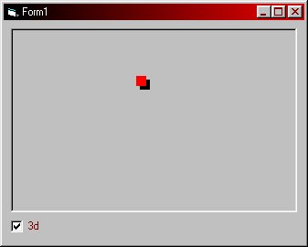



## Simple Animation using SetPixel API

### Description

This code will show you how to use the SetPixel API by drawing a 3d square that follows your mouse when it is over the picturebox that its setting the pixel on.
 
### More Info
 

             |
---                |---
**Submitted On**   |2000-10-14 15:52:46
**By**             |[Andrew Heinlein \(Mouse\)](https://github.com/Planet-Source-Code/PSCIndex/blob/master/ByAuthor/andrew-heinlein-mouse.md)
**Level**          |Beginner
**User Rating**    |4.3 (17 globes from 4 users)
**Compatibility**  |VB 4\.0 \(32\-bit\), VB 5\.0, VB 6\.0
**Category**       |[Graphics](https://github.com/Planet-Source-Code/PSCIndex/blob/master/ByCategory/graphics__1-46.md)
**World**          |[Visual Basic](https://github.com/Planet-Source-Code/PSCIndex/blob/master/ByWorld/visual-basic.md)
**Archive File**   |[CODE\_UPLOAD1065810142000\.zip](https://github.com/Planet-Source-Code/andrew-heinlein-mouse-simple-animation-using-setpixel-api__1-12056/archive/master.zip)

